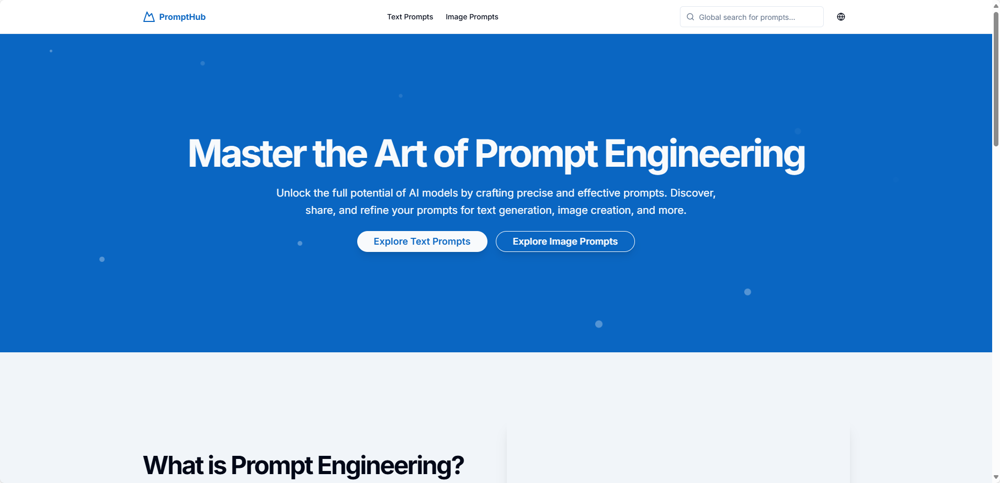
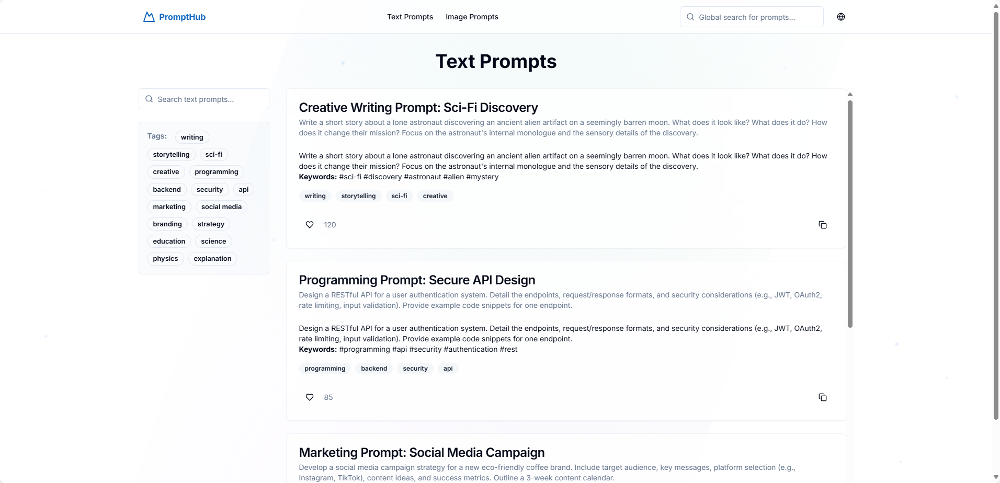
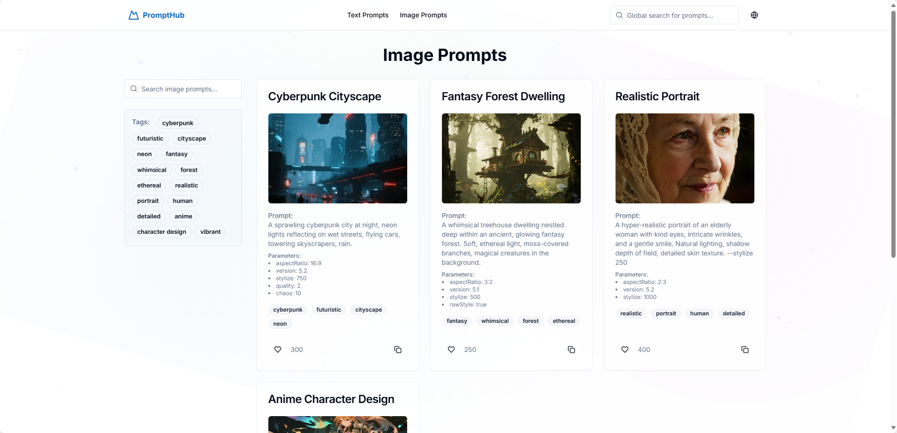

# Prompt Engineering - 提示工程开发平台


## 项目简介

Prompt Engineering 是一个基于 Next.js 的提示工程分享平台，旨在帮助开发者高效地创建、测试和部署 AI 提示工程应用。支持中英文对照，项目中为示例的提示词。

## 预览图

### 首页



### 文案



### 图像



## 功能特点

- **模块化开发**：支持组件化开发，便于代码复用
- **国际化支持**：内置多语言支持，便于全球用户使用
- **响应式设计**：适配各种设备，提供最佳用户体验

## 项目结构说明

- `/app` - Next.js 应用程序主目录
- `/components` - UI 组件和自定义组件
- `/contexts` - React 上下文，包括语言设置
- `/hooks` - 自定义 React 钩子
- `/services` - 后端服务接口，如汇率服务
- `/public` - 静态资源文件
- `/styles` - 全局样式定义

## 开发环境配置

### 前置要求

- Node.js 18.x 或更高版本
- pnpm (推荐) 或 npm, yarn

### 安装依赖

```bash
# 克隆项目
git clone https://github.com/Hanyeweiyang/unit-converter.git
cd unit-converter

# 使用pnpm安装依赖
pnpm install
```

### 开发命令

```bash
# 启动开发服务器
pnpm dev

# 构建生产版本
pnpm build

# 启动生产服务器
pnpm start

# 代码检查
pnpm lint
```

## 部署信息

项目已部署在 Vercel 平台：

**[https://zjh-unit-converter.vercel.app/](https://zjh-unit-converter.vercel.app/)**

## 许可证

本项目采用 MIT 许可证
